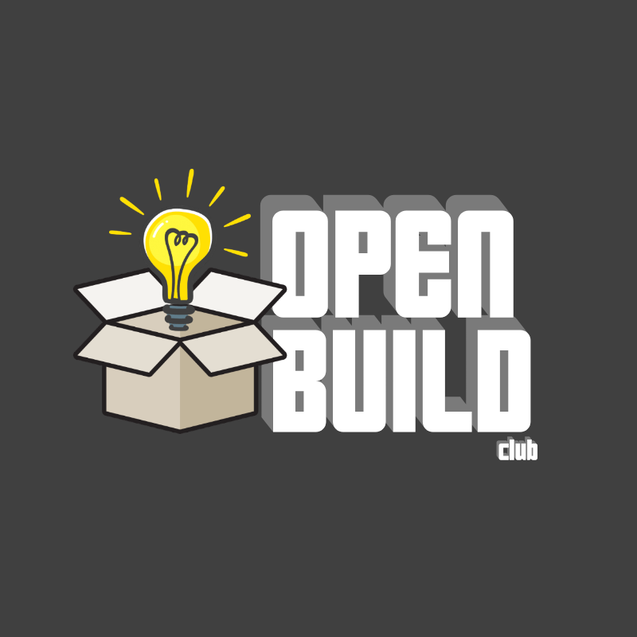

  

## Mini FPV Drift Car
By Open Build Club, a recognized organization of the Pennsylvania State University

# Contribution Guidlines

NOT FINISHED

# Documentation Structure

The documentation is broken into three main documents: The README (what you are currently reading), the Design Document, and the Production Document.

The Design Document contains information that explains and justifies the final design. Reading it is not required to manufacture the design, and so the purpose of it is to answer any questions that may arise in the construction of the design. An added benefit of the Design Document is that it eases the contribution process by explaining the design philosophy (and possibly the shortcomings) of the existing parts.

The Production Document contains all of the information necessary for the production of the part, including the Bill of Materials, Necessary Equipment, and a step-by-step guide on how to produce each part and assembly. Engineering drawings and supplementary images/videos will be provided where appropriate.

# What does Open Source mean?

The Open Source Movement seeks to make information free ("free" as in free speech, not free beer). Traditionally, "information" has narrowly meant software, but in recent years this has expanded to also include hardware.

There have been many different organizations that have adhered to and developed the Open Source Movement, and they are very authoritative sources on what the movement means and (just as importantly) doesn't mean. The GNU Project defines Free Software on the "Philosophy" section of their website as follows:

> Specifically, free software means users have the four essential freedoms: (0) to run the program, (1) to study and change the program in source code form, (2) to   redistribute exact copies, and (3) to distribute modified versions.

It is important to bring up the Free Software Movement specifically as it is a very mature and established movement, and as such the related Free Hardware movement inherits many of its tenets from it. However, there are some key differences between Free and Open Source Software and Hardware. The GNU Project, on the same webpage, also argues why their purview is specific to software:

> Software differs from material objects—such as chairs, sandwiches, and gasoline—in that it can be copied and changed much more easily. These facilities are why software is useful; we believe a program's users should be free to take advantage of them, not solely its developer.

While this view is not necessarily outdated, it is certainly a noble goal to try and make it so. Whether they be called "Hackspaces" or "Makerspaces," there is a growing contingency of people who feel the need to be in control of their products—not the other way around. We don't believe that this movement is contrary to the goals of the Free Software Movement, but rather a complementary expansion of the movement. While the barrier for average people to manufacture their own glasses or computer chips is clearly insurmountable for the foreseeable future, it is clear that giving the general population more alternatives and more control over their material products will increase their freedom.

## Right to Repair

NOT FINISHED

# What is Open Build Club?

Open Build Club is a recognized organization of the Pennsylvania State University.

WRITE MORE THAN THIS--MISSION STATEMENT???
